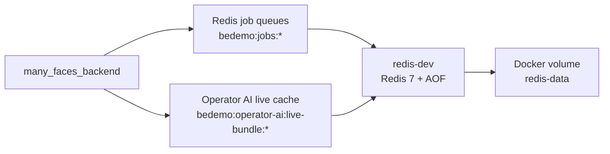

# Many Faces Redis (`many_faces_redis`)

**Redis infrastructure for Many Faces AI.** This standalone submodule provides the local Redis 7 node used by the backend for asynchronous jobs and for the operator AI live-statistics bundle cache.

| Start here       | Value                                                |
| ---------------- | ---------------------------------------------------- |
| Start full stack | `../scripts/start-all-dev.sh` from `many_faces_main` |
| Standalone       | `./scripts/start-redis.sh`                           |
| Host port        | `localhost:6379`                                     |
| Main keys        | `bedemo:jobs:*`, `bedemo:operator-ai:live-bundle:*`  |



## What runs

- **Redis** — port **6379** on localhost
- **AOF** enabled (`appendonly yes`) — data in Docker volume `redis-data`

## Requirements

- Docker and Docker Compose v2 (`docker compose`) or `docker-compose`

## Start

```bash
cd many_faces_redis
./scripts/start-redis.sh
```

Or:

```bash
cd many_faces_redis
docker-compose up -d
```

## Stop

```bash
./scripts/stop-redis.sh
```

## Full reset (including data)

```bash
./scripts/clear-redis.sh
```

**Monorepo guide:** [`docs/guides/redis-workers-and-queues.md`](https://github.com/01laky/many_faces_main/blob/main/docs/guides/redis-workers-and-queues.md). Full stack: `./scripts/start-all-dev.sh` from **`many_faces_main`** starts Redis with the API unless you opt out.

## Connection from `many_faces_main`

The **be-demo-dev** container in root `docker-compose.dev.yml` uses:

`Redis__Configuration=host.docker.internal:6379`

Start Redis from this repo (published port 6379), then the backend.

## Git submodule in the monorepo root

From `many_faces_main` root:

```bash
git submodule update --init many_faces_redis
```

Submodule workflow and publishing notes (paths are written for the monorepo checkout):

- [docs/guides/git-submodules.md](https://github.com/01laky/many_faces_main/blob/main/docs/guides/git-submodules.md)

**Documentation hub** (all guides, including AI-assisted content approval and Redis job semantics):

- [docs/README.md](https://github.com/01laky/many_faces_main/blob/main/docs/README.md)

Related stacks: [`many_faces_database`](https://github.com/01laky/many_faces_database), [`many_faces_backend`](https://github.com/01laky/many_faces_backend) (queue consumer), [`many_faces_logger`](https://github.com/01laky/many_faces_logger) (Dozzle).

## Container

| Name        | Port |
| ----------- | ---- |
| `redis-dev` | 6379 |

## Test

```bash
redis-cli -h 127.0.0.1 -p 6379 ping
# PONG
```
